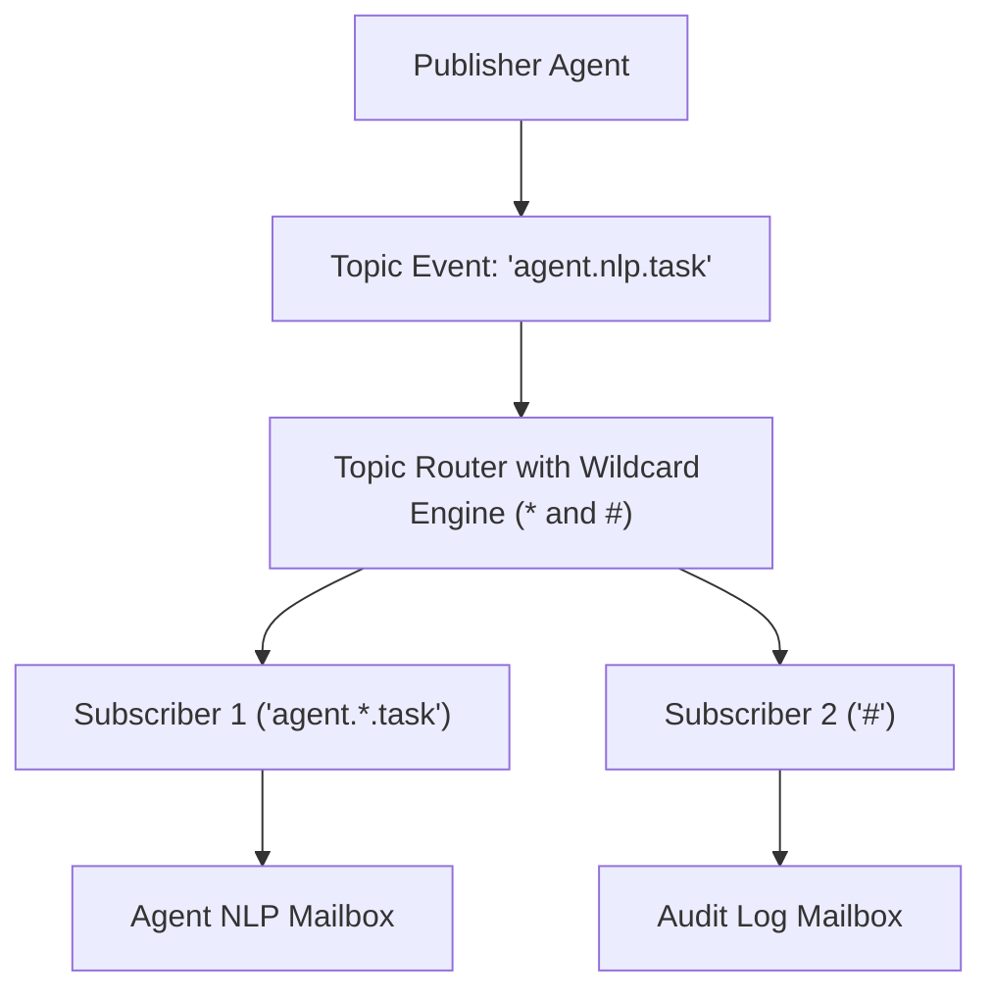

# genpark-agent-message-bus-topic-router-skill

Agent Skill implementing **Hierarchical Topic Routing & Inter-Agent Pub/Sub Message Bus** in 100% Python standard library.

## Architectural Flow

```mermaid
flowchart TD
    Pub["Publisher Agent"] --> Msg["Topic Event: 'agent.nlp.task'"]
    Msg --> Bus["Topic Router with Wildcard Engine (* and #)"]
    Bus --> Sub1["Subscriber 1 ('agent.*.task')"]
    Bus --> Sub2["Subscriber 2 ('#')"]
    Sub1 --> Deliver1["Agent NLP Mailbox"]
    Sub2 --> Deliver2["Audit Log Mailbox"]
```
